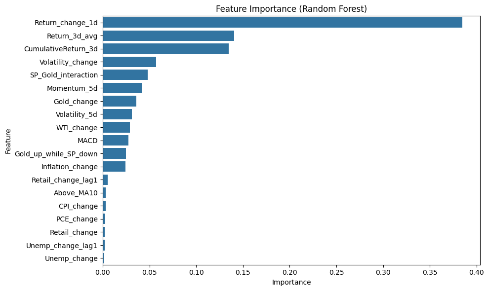
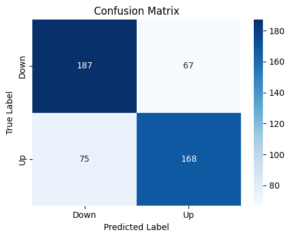
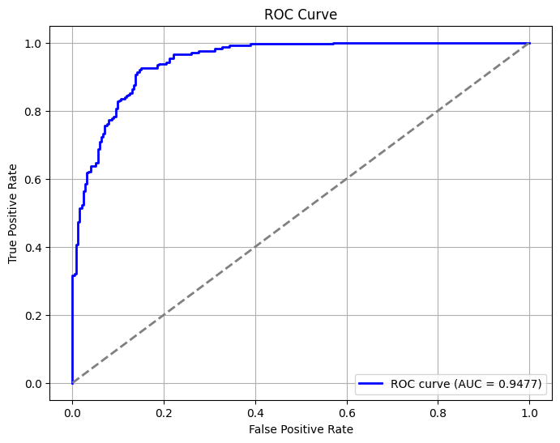
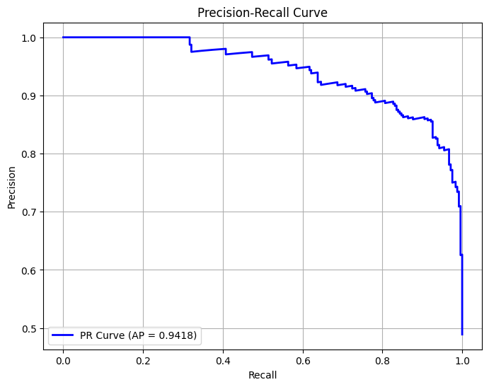

# 📈 S&P 500 지수 방향성 예측을 위한 경제지표 기반 분류 모델링

> 경제지표와 금융 자산 데이터를 활용한 S&P 500 단기 방향성 예측 머신러닝 프로젝트

---

## 🔍 프로젝트 개요

미국 S&P 500 지수는 글로벌 증시의 방향성과 투자 심리를 반영하는 핵심 지표입니다.  
본 프로젝트는 금융 자산 가격 및 거시경제 지표를 활용하여 **S&P 500의 단기 상승 여부를 예측하는 분류 모델을 구축**하고, 투자 판단을 위한 **데이터 기반 의사결정 근거를 제시**하는 것을 목표로 합니다.

---

## 📘 주요 내용 요약

- **📆 데이터 기간**: 2015.01.01 ~ 2024.12.31
- **📊 입력 변수**
  - 금융 자산: VIX, 금, 구리, 원유, 국채 수익률 등
  - 거시경제 지표: CPI, 실업률, 소매판매, 기대 인플레이션 등
- **🔧 전처리 및 엔지니어링**
  - 변화율, 이동평균, 변동성, 상호작용 변수 등 파생 변수 30여 개 생성
  - SMOTE로 클래스 불균형 보정, StandardScaler로 정규화
- **🤖 모델링**
  - Logistic Regression, Random Forest 적용
  - 시계열 특성을 고려한 시간순 분할 (train: 2015–2022 / test: 2023–2024)
- **🎯 타겟 정의**: 다음 날 S&P500이 **0.2% 이상 상승하는지 여부 (binary classification)**

---

## ✅ 모델 성능 비교 (Test Set)

| 모델             | Accuracy | Precision | Recall | F1 Score | ROC-AUC |
|------------------|----------|-----------|--------|----------|---------|
| Logistic Reg.    | 0.7163   | 0.7179    | 0.6914 | 0.7044   | 0.79    |
| Random Forest    | 0.8753   | 0.8787    | 0.8642 | 0.8714   | 0.94    |

---

## 📊 주요 결과 시각화

- 🔎 변수 중요도 (Random Forest)  
  

- ✅ Confusion Matrix  
  

- 📈 ROC Curve (AUC = 0.94)  
  

- 📉 Precision-Recall Curve  
  

---

## 🧠 주요 인사이트

- **S&P500의 자체 기술 지표(모멘텀, 변동성)**가 가장 강한 예측 변수
- 단순 수치보다 **변화율 기반 변수**의 예측력이 높음 (ex. CPI_change, WTI_change)
- 금값과 S&P 간 반대 방향 움직임은 **위험 회피 심리를 반영하는 신호 변수**

---

## 📎 보고서 및 코드 링크

- 📄 [최종 보고서 PDF](./reports/Project_Report.pdf)
- 📓 분석 코드: [`notebooks/`](./notebooks/)

---

## 📁 폴더 구조

```
sp500-direction-prediction/
├── README.md
├── notebooks/
│   ├── 01_modeling.ipynb
├── data/
│   ├── raw/
│   └── processed/
├── reports/
│   └── Project_Report.pdf
├── images/
│   ├── feature.png
│   ├── confusion.png
│   ├── ROC_Curve.png
│   └── Precision_Recall.png
├── requirements.txt
└── .gitignore
```


---

## 🛠 사용 라이브러리 및 환경

```bash
# Conda 환경 구성
conda create -n sp500env python=3.9
conda activate sp500env
pip install -r requirements.txt

